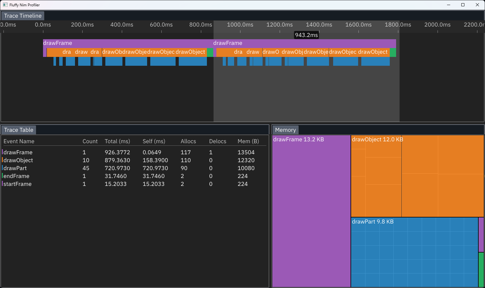

# Fluffy - A Nim Profile Viewer



Fluffy is a profile viewer written in Nim using the Silky UI library. It can load simple Chrome JSON style profile files. It also includes a library for creating Chrome style JSON profile files in Nim programs.

## Usage

To run the trace viewer:

`nim r src/fluffy.nim traces/mem_trace.json`

To create a trace file:

```nim
import std/[times, os], fluffy/measure

proc doSomething() {.measure.} =
  sleep(10)

startTrace()
for i in 0 ..< 20:
  doSomething()
endTrace()

dumpMeasures(0.0, "tmp/trace.json")
```

## Features

It has tree main panels:

### Trace Timeline

Displays a timeline of the trace. You can pan with middle mouse button and zoom with mouse wheel. You cal select a range of the timeline to view the trace table and treemap. You can also click on individual events.

### Trace Table

Displays a table of the trace. You can sort the columns by clicking on the column headers.

### Trace Treemap

Displays a treemap of the trace. You can select a range of the treemap to view the trace table. You can also click on individual events.
